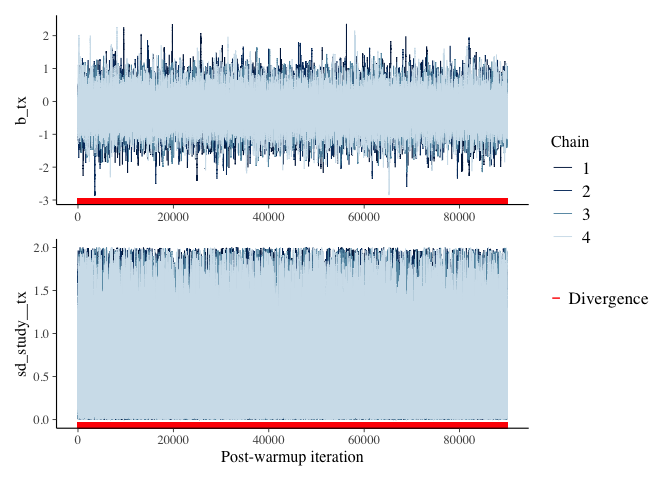
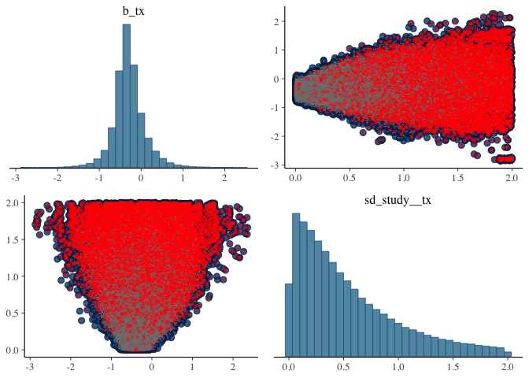
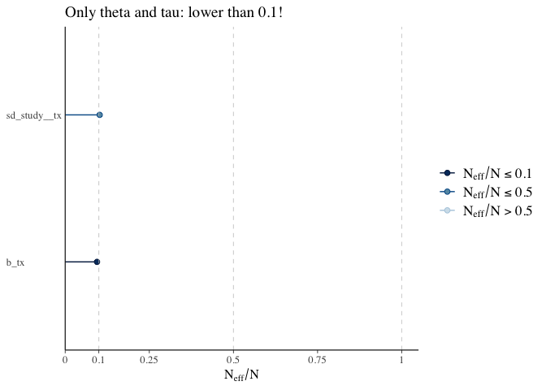
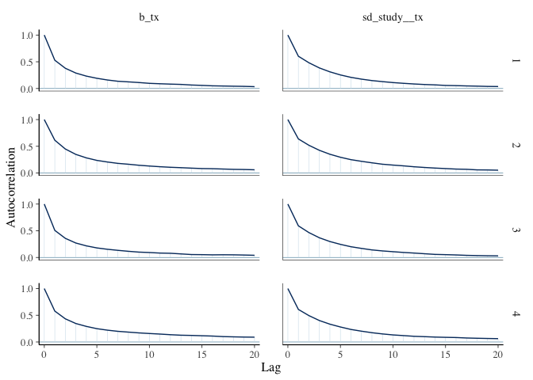
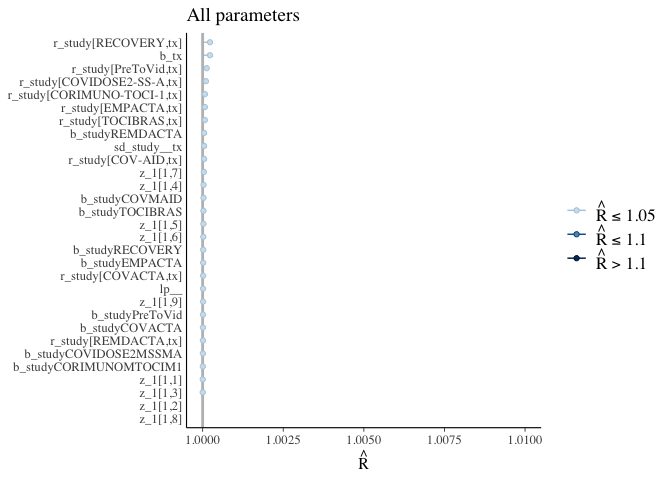

Case Study
================
Arthur M. Albuquerque
2022-07-23

# Introduction

Here, I will discuss technical implications of fitting a Bayesian
Meta-analysis with the Binomial likelihood.

All analyses were conducted in R (R Environment version 4.1.2). I will
use [Stan](http://mc-stan.org) through the R package
[brms](https://paul-buerkner.github.io/brms/index.html). Instructions to
download RStan and brms can be found
[here](https://mc-stan.org/users/interfaces/rstan.html) and
[here](https://github.com/paul-buerkner/brms#how-do-i-install-brms),
respectively. Lastly, I also used
[CmdStanR](https://mc-stan.org/cmdstanr/), a lightweight interface to
Stan for R users. Here is the code to install it:

    repos <- c(CRAN = "https://cloud.r-project.org", cmdstanr = "https://mc-stan.org/r-packages/")
    options(repos = repos)
    install.packages("cmdstanr")

# Packages/data

Load packages

``` r
# Ensures the package "pacman" is installed
if (!require("pacman")) install.packages("pacman")

pacman::p_load(brms, bayesplot, dplyr, ggplot2, ggdist,
               tidyr, patchwork)
```

Load data from [Albuquerque et
al. 2022](https://jamanetwork.com/journals/jamanetworkopen/fullarticle/2789444).
This dataset only regards to the simple oxygen subgroup. I excluded 1
study that had no events in both treatment arms (BACC-Bay).

``` r
d = 
  structure(list(study = c("CORIMUNO-TOCI-1", "COV-AID", "COVACTA", 
                         "COVIDOSE2-SS-A", "EMPACTA", "PreToVid", "RECOVERY",
                         "REMDACTA", "TOCIBRAS", "CORIMUNO-TOCI-1", "COV-AID",
                         "COVACTA", "COVIDOSE2-SS-A", "EMPACTA", "PreToVid",
                         "RECOVERY", "REMDACTA", "TOCIBRAS"), 
                 events = c(1, 1, 1, 0, 11, 12, 125, 1, 1, 3, 0, 1, 1, 4, 19,
                            173, 0, 0),
                 total = c(10, 25, 11, 6, 128, 116, 766, 14, 20, 12, 21, 12, 1,
                           72, 118, 765,2, 14),
                 tx = c("toci", "toci", "toci", "toci", "toci", "toci", "toci",
                        "toci", "toci", "control", "control", "control",
                        "control", "control", "control", "control", "control",
                        "control")),
            row.names = c(NA,-18L),
            class = "data.frame") |> 
  # dummy approach
  mutate(tx = ifelse(tx == "toci", 1, 0))
```

Dataset preview

``` r
head(d)
```

    ##             study events total tx
    ## 1 CORIMUNO-TOCI-1      1    10  1
    ## 2         COV-AID      1    25  1
    ## 3         COVACTA      1    11  1
    ## 4  COVIDOSE2-SS-A      0     6  1
    ## 5         EMPACTA     11   128  1
    ## 6        PreToVid     12   116  1

# Model description

We will fit the Binomial model, described by [Jackson et
al.](https://doi.org/10.1002/sim.7588) as “Model 2: the Simmonds and
Higgins model”.

$$
\begin{align*}

logit(\pi_{ij}) &= \gamma_i + j\theta_i\\

\theta_i &\sim N(0, \tau^2)

\end{align*}
$$

This model can be translated to brms’ synthax as:

``` r
brms::bf(
    events | trials(total) ~ 0 + study + tx + (tx - 1|study)
  )
```

    ## events | trials(total) ~ 0 + study + tx + (tx - 1 | study)

And we can double check it by asking brms what parameters we have with
the formula above:

``` r
get_prior(
  brms::bf(
    events | trials(total) ~ 0 + study + tx + (tx - 1|study)
  ),
  family = "binomial", data = d) |> 
  data.frame() |> 
  select(class, coef)
```

# Priors

$$
\begin{align*}

\gamma & \sim N(0, 10^2) \\
\theta& \sim N(0, 10^2) \\

\tau & \sim U(0, 2)

\end{align*}
$$

Quick prior visualization to better understand these beliefs.

In regards to *γ*, here are the plots under the logit link (log odds)
and in the response scale (proportion):

``` r
set.seed(123) 
prior_data = 
  data.frame(
  x = rnorm(1e5, mean = 0, sd = 10)
) |> 
  mutate(logOR = x,
         OR = exp(x),
         "Log Odds" = x,
         "Proportion" = inv_logit_scaled(x))

prior_data |> 
  pivot_longer(4:5) |> 
  ggplot() +
  aes(x = value) +
  geom_density() +
  facet_wrap(~ name, scales = "free") +
  theme_minimal()
```


In regards to *θ*, here are the plots under the logit link (log odds
ratio) and in the linear scale (odds ratio):

``` r
p1 = 
  prior_data |> 
  pivot_longer(2) |> 
  ggplot() +
  aes(x = value) +
  geom_density() +
  facet_wrap(~ name, scales = "free") +
  theme_minimal()

p2 = 
  prior_data |> 
  pivot_longer(3) |> 
  ggplot() +
  aes(x = value) +
  geom_density() +
  facet_wrap(~ name, scales = "free") +
  theme_minimal() +
  coord_cartesian(x = c(0, 100), y = c(0, 0.01))

p1 + p2
```


Lastly, here is the plot regarding *τ*, the between-study standard
deviation parameter (log odds ratio scale):

``` r
data.frame(
  "logOR" = runif(1e5, min = 0, max = 2)
) |> 
  pivot_longer(1) |> 
  ggplot() +
  aes(x = value) +
  geom_density() +
  theme_minimal() +
  facet_wrap(~ name, scales = "free") +
  coord_cartesian(y = c(0, 1))
```


# Model fitting

``` r
mf = 
  brms::bf(
    events | trials(total) ~ 0 + study + tx + (tx - 1|study)
  )

priors = 
  prior(normal(0, 10), class = "b") +
  prior(uniform(0, 2), class = "sd") 

ma_toci = 
  brms::brm(
    
  data = d,
  family = binomial,
  formula = mf,
  prior = priors,
  
  control = list(adapt_delta = .99),
  backend = "cmdstanr", # faster
  cores = parallel::detectCores(),
  chains = 4,
  warmup = 10000, 
  iter = 20000, 
  seed = 123
)
```

    ## Start sampling

    ## Chain 1 Rejecting initial value:

    ## Chain 1   Log probability evaluates to log(0), i.e. negative infinity.

    ## Chain 1   Stan can't start sampling from this initial value.

    ## Chain 2 Rejecting initial value:

    ## Chain 2   Log probability evaluates to log(0), i.e. negative infinity.

    ## Chain 2   Stan can't start sampling from this initial value.

    ## Warning: 7195 of 40000 (18.0%) transitions ended with a divergence.
    ## See https://mc-stan.org/misc/warnings for details.

# Model diagnostics

Overall diagnostics:

``` r
rstan::check_hmc_diagnostics(ma_toci$fit)
```

    ## 
    ## Divergences:

    ## 7195 of 40000 iterations ended with a divergence (17.9875%).
    ## Try increasing 'adapt_delta' to remove the divergences.

    ## 
    ## Tree depth:

    ## 0 of 40000 iterations saturated the maximum tree depth of 10.

    ## 
    ## Energy:

    ## E-BFMI indicated no pathological behavior.

Let’s better understand these divergences following instructions by the
Stan team discussed in [“Visual MCMC diagnostics using the bayesplot
package”](https://mc-stan.org/bayesplot/articles/visual-mcmc-diagnostics.html)

-   Trace plots for *θ* (“b_tx”) and *τ* (“sd_study\_\_tx”),
    respectively:

``` r
# Extract divergence info
np_cp = bayesplot::nuts_params(ma_toci)

mcmc_trace(ma_toci, pars = c("b_tx"), np = np_cp) /
  mcmc_trace(ma_toci, pars = c("sd_study__tx"), np = np_cp) +
  xlab("Post-warmup iteration") +
  plot_layout(guides='collect')
```



``` r
mcmc_pairs(ma_toci, np = np_cp, pars = c("b_tx","sd_study__tx"))
```



``` r
mcmc_scatter(
  as.array(ma_toci),
  pars = c("b_tx","sd_study__tx"),
  np = np_cp,
  size = 1
)
```


Moreover, these two parameters (*θ*, *τ*) showed very low effective
sample size, which is concerning.

Nevertheless, within all parameters, all chains converged to a common
distribution, represented by low R-hat values.

``` r
neff_ratio(ma_toci) |> 
  mcmc_neff(size = 2) + yaxis_text(hjust = 0) +
  labs(title = "All parameters")
```


``` r
neff_ratio(ma_toci, pars = c("b_tx","sd_study__tx")) |> 
  mcmc_neff(size = 2) + yaxis_text(hjust = 0) +
  labs(title = "Only theta and tau: lower than 0.1!")
```



Accordingly, both parameters show not neglible levels of autocorrelation
across high lags (5 to 10)

``` r
as.array(ma_toci) |> 
  mcmc_acf(pars = c("b_tx","sd_study__tx"), lags = 20)
```



Nevertheless, within each parameter, chains have converged to a common
distribution:

``` r
rhat(ma_toci) |> 
  mcmc_rhat() + yaxis_text(hjust = 1) +
  xlim(c(1, 1.01)) +
  labs(title = "All parameters")
```

    ## Scale for 'x' is already present. Adding another scale for 'x', which will
    ## replace the existing scale.



# Conclusion

Regarding Albuquerque et al.’s data on the simple oxygen only subgroup,
this model with vague priors does not explore the posterior distribution
adequately.

Therefore, I do not feel comfortable in trusting the 95% CrI of the
treatment effect parameter (*θ*, depicted as odds ratio below):

``` r
fixef(ma_toci) |> tail(1) |> exp()
```

    ##     Estimate Est.Error     Q2.5    Q97.5
    ## tx 0.7530889  1.486241 0.361069 1.857915
